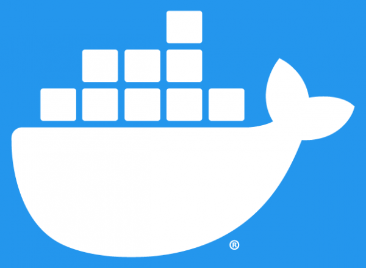

# Video-store API 📽️
This API tries to emulate in a simplified form a video-store which you will be able to Create, Read, Update and Delete users, films, and orders.
# Get started 🚀
You will need some extra programs, like Docker because I use there a mongodb service, you can download [here](https://www.docker.com/get-started). 

Then, when you have the project downloaded, run on your terminal the following commands:  
- npm i (this will install all dependencies required)
- npm start (this will start the server at port 3000)  

This last command, will left the terminal running (you can install nodemon for don't have to stop and start all the time the server with each change... you only need to install it once. Write: npm i -g nodemon), open a new terminal and write the next command:
- docker run --rm -p 27017:27017 mongo (with this, you will have a mongodb service on docker)

# Technologies used 🛠️

# CRUD with POSTMAN 
You can get my CRUD collection on postman if you want to try the methods   

